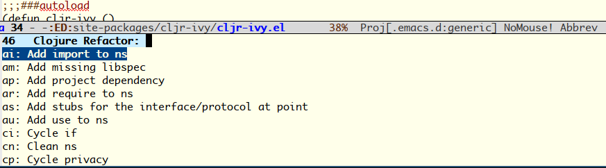

# Clojure Refactor from Ivy

[](https://melpa.org/#/cljr-ivy)


Please, use [MELPA](https://melpa.org/#/) to install the package:

```
M-x package-install cljr-ivy
```

## Manual installation
Clone the repository:
```
cd ~/.emacs.d/site-packages
git submodule add https://github.com/wandersoncferreira/cljr-ivy
```

Add the package to your load path:

```elisp
(add-to-list 'load-path "~/.emacs.d/site-packages/cljr-ivy")
(require 'cljr-ivy)
```

This assumes you have a `site-packages` folder inside your `emacs.d`.


## Usage
Now you need to bind the `cljr-ivy` command to some keybinding, I recommend:

```elisp
(eval-after-load 'clojure
	'(define-key clojure-mode-map (kbd "C-c C-r") 'cljr-ivy))
```


# Screenshot


